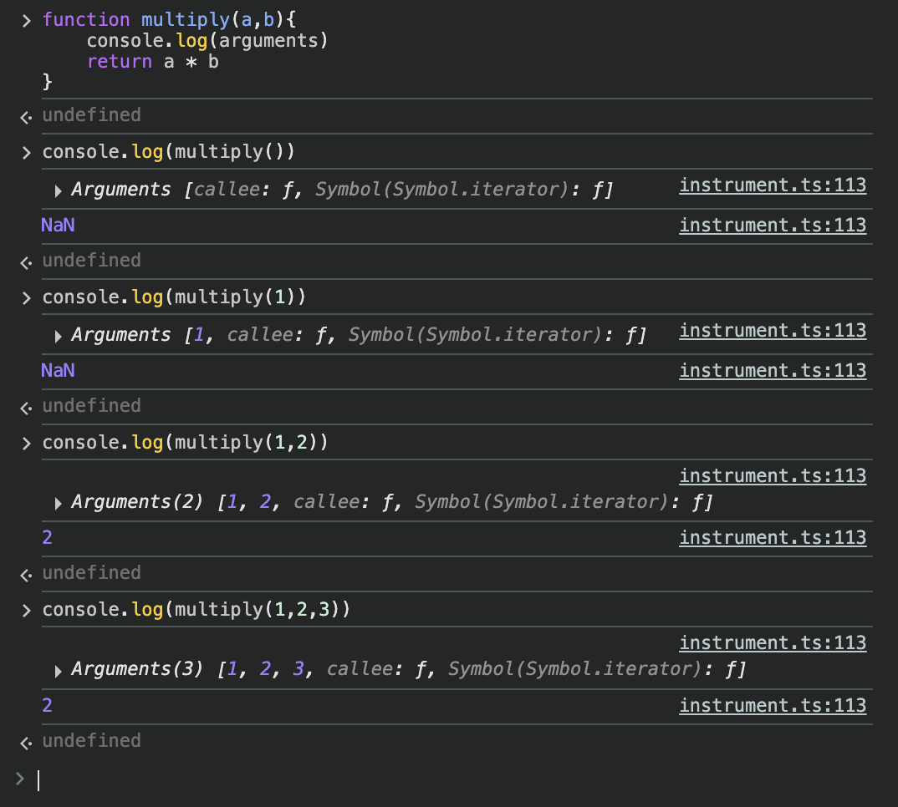

## 일급 객체란?

다음 조건을 만족하는 객체를 말한다.

1. 변수나 자료구조에 담을 수 있다.
2. 함수의 매개변수에 전달할 수 있다.
3. 함수의 반환값으로 사용할 수 있다.
4. 런타임에 생성할 수 있다.

### 함수는 일급 객체다

```js
// 1. 변수나 자료구조에 담을 수 있다.
const add = function (x, y) {
    return x + y;
};
const arr = [
    function (x, y) {
        return x + y;
    },
];
const obj = {
    func: function (x, y) {
        return x + y;
    },
};
```

-   함수도 객체이기에, 프로퍼티를 가진다.
-   함수 객체의 프로퍼티에 대해 하나하나 살펴보자.

### arguments property

-   함수 호출 시 함수에 전달된 인수(argument)들의 정보를 담고 있는 유사 배열 객체
-   매개변수와 인수의 개수가 일치하는지 확인하지 않는다.
<div align="center">
    
</div>

-   이는, 인수의 개수가 가변적인 함수에서 유용하게 사용된다.

```js
function sum() {
    let res = 0;
    for (let i = 0; i < arguments.length; i++) {
        res += arguments[i];
    }
    return res;
}
console.log(sum(1, 2)); // 3
console.log(sum(1, 2, 3, 4, 5)); // 15
```

-   하지만, ES6의 rest 파라미터 문법을 사용하는 것이 더 편리하다.

```js
function sum(...args) {
    return args.reduce((acc, cur) => acc + cur, 0);
}
console.log(sum(1, 2)); // 3
console.log(sum(1, 2, 3, 4, 5)); // 15
```

### length property

-   함수가 선언될 때 정의된 매개변수의 개수를 나타내는 정수 값

### name property

-   함수 이름을 나타내는 문자열 값

```js
function foo() {}
console.log(foo.name); // "foo"
```

### **proto** property

-   모든 객체는 자신의 상위 객체를 가리키는 **proto** 프로퍼티를 갖는다.
-   함수도 객체이기에 **proto** 프로퍼티를 갖는다.

```js
const obj = { a: 1 };
console.log(obj.__proto__ === Object.prototype); // true
```

### prototype property

-   constructor 함수만이 갖는 프로퍼티
-   함수 객체는 prototype을 소유하나, 일반 객체는 소유하지 않는다.

```js
function Foo() {}
console.log(Foo.prototype); // {constructor: ƒ}
const obj = {};
console.log(obj.prototype); // undefined
```

## 📋 요약

### 주요 내용

**1. 일급 객체의 조건**

-   변수나 자료구조에 담을 수 있다
-   함수의 매개변수에 전달할 수 있다
-   함수의 반환값으로 사용할 수 있다
-   런타임에 생성할 수 있다

**2. JavaScript 함수는 일급 객체**

-   함수도 객체이므로 프로퍼티를 가질 수 있다
-   변수, 배열, 객체에 저장 가능
-   다른 함수의 인수나 반환값으로 사용 가능

**3. 함수 객체의 주요 프로퍼티**

-   **arguments**: 함수 호출 시 전달된 인수들의 정보를 담은 유사 배열 객체
-   **length**: 함수가 선언될 때 정의된 매개변수의 개수
-   **name**: 함수의 이름을 나타내는 문자열
-   \***\*proto\*\***: 상위 객체를 가리키는 프로퍼티 (모든 객체가 가짐)
-   **prototype**: constructor 함수만이 가진 프로퍼티

**4. arguments vs rest 파라미터**

-   arguments: ES5 이전 방식, 유사 배열 객체
-   rest 파라미터: ES6+ 방식, 진짜 배열, 더 편리함

## 🎯 면접 질문

### 기본 개념 질문

**Q1. 일급 객체(First-Class Object)란 무엇인가요?**

-   A: 일급 객체는 다음 4가지 조건을 만족하는 객체입니다: 1) 변수나 자료구조에 담을 수 있다, 2) 함수의 매개변수에 전달할 수 있다, 3) 함수의 반환값으로 사용할 수 있다, 4) 런타임에 생성할 수 있다.

**Q2. JavaScript에서 함수가 일급 객체인 이유를 설명해주세요.**

-   A: JavaScript의 함수는 객체이므로 프로퍼티를 가질 수 있고, 변수에 할당하거나 다른 함수의 인수로 전달하거나 반환값으로 사용할 수 있습니다. 또한 런타임에 동적으로 생성할 수 있어 일급 객체의 모든 조건을 만족합니다.

### 함수 프로퍼티 관련 질문

**Q3. arguments 객체와 rest 파라미터의 차이점을 설명해주세요.**

-   A:
    -   **arguments**: 유사 배열 객체, ES5 이전 방식, 모든 함수에서 자동 생성
    -   **rest 파라미터**: 진짜 배열, ES6+ 방식, 명시적으로 선언해야 함, 화살표 함수에서도 사용 가능
    -   rest 파라미터가 더 현대적이고 편리한 방식입니다.

**Q4. 다음 코드의 실행 결과를 예측해주세요.**

```js
function test(a, b, c) {
    console.log(test.length);
    console.log(test.name);
    console.log(arguments.length);
}
test(1, 2, 3, 4, 5);
```

-   A:
    -   `test.length`: 3 (매개변수 개수)
    -   `test.name`: "test" (함수 이름)
    -   `arguments.length`: 5 (실제 전달된 인수 개수)

**Q5. 함수의 length 프로퍼티는 언제 유용한가요?**

-   A: 함수 오버로딩, 가변 인수 함수 처리, 함수 검증 등에서 유용합니다. 예를 들어, 매개변수 개수에 따라 다른 동작을 하거나, 최소 인수 개수를 확인할 때 사용할 수 있습니다.

### 고급 개념 질문

**Q6. arguments 객체의 한계점과 해결 방법을 설명해주세요.**

-   A:
    -   **한계점**: 유사 배열 객체라서 배열 메서드 사용 불가, 화살표 함수에서 사용 불가
    -   **해결 방법**: rest 파라미터 사용, Array.from() 또는 스프레드 연산자로 배열 변환

**Q7. prototype 프로퍼티는 어떤 함수만 가지고 있나요?**

-   A: constructor 함수만이 prototype 프로퍼티를 가집니다. 일반 객체나 non-constructor 함수(화살표 함수, 메서드 등)는 prototype 프로퍼티를 가지지 않습니다.

**Q8. 함수의 name 프로퍼티가 언제 유용한가요?**

-   A: 디버깅, 함수 식별, 동적 함수 처리, 에러 추적 등에서 유용합니다. 특히 익명 함수를 사용할 때 함수를 식별하거나, 디버거에서 함수를 구분할 때 도움이 됩니다.

**Q9. 다음 코드에서 각 함수의 name 프로퍼티 값을 예측해주세요.**

```js
function namedFunc() {}
const anonymousFunc = function () {};
const arrowFunc = () => {};
const obj = {
    method() {},
    property: function () {},
};
```

-   A:
    -   `namedFunc.name`: "namedFunc"
    -   `anonymousFunc.name`: "anonymousFunc" (변수명 사용)
    -   `arrowFunc.name`: "arrowFunc" (변수명 사용)
    -   `obj.method.name`: "method"
    -   `obj.property.name`: "property"

**Q10. 함수를 일급 객체로 사용하는 실무 예시를 들어주세요.**

-   A:
    -   **콜백 함수**: `setTimeout`, `addEventListener` 등
    -   **고차 함수**: `map`, `filter`, `reduce` 등
    -   **함수 팩토리**: 함수를 반환하는 함수
    -   **이벤트 핸들러**: DOM 이벤트 처리
    -   **미들웨어**: Express.js의 미들웨어 패턴

## 📝 추가 학습 포인트

### 핵심 암기 사항

1. **일급 객체 4가지 조건** - 변수 저장, 매개변수 전달, 반환값, 런타임 생성
2. **arguments는 유사 배열** - 배열 메서드 사용 불가, length만 있음
3. **rest 파라미터는 진짜 배열** - 모든 배열 메서드 사용 가능
4. **prototype은 constructor만** - 일반 객체나 non-constructor는 없음
5. **함수도 객체** - 프로퍼티를 가질 수 있음

### 실무에서 주의할 점

-   arguments 대신 rest 파라미터 사용 권장
-   화살표 함수에서는 arguments 사용 불가
-   함수의 name 프로퍼티는 디버깅에 유용
-   prototype 프로퍼티는 생성자 함수에서만 의미 있음
-   함수를 값으로 사용할 때는 일급 객체 특성 활용
