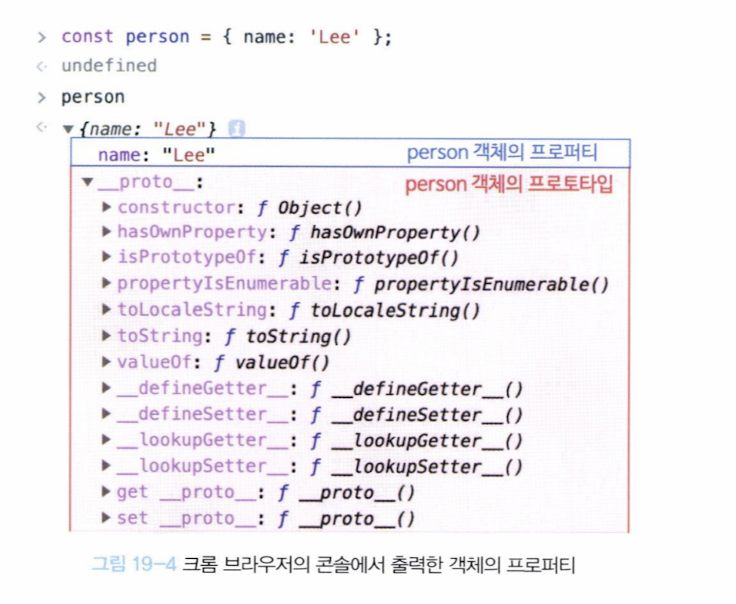

## 객체지향 프로그래밍

-   객체: 속성을 통해 여러 개의 값을 하나의 단위로 구성한 복잡한 자료구조
-   객체지향 프로그래밍은 프로그래밍을 객체 단위로 나누어 설계하는 방법
-   state: 객체가 가지고 있는 속성
-   behavior: 객체가 가지고 있는 기능
-   state data는 property, behavior data는 method라고도 함
-   각 객체는 고유의 기능을 갖는 독립적인 개체로 볼 수 있지만, 다른 객체와 관계를 가질 수도 있음.
-   또한, 동작을 상속받아 사용하기도 함.

## 상속과 프로토타입

-   js는 프로토타입을 기반으로 상속을 구현
-   아래 예제는, 프로토타입을 통해 불필요한 중복 메소드를 제거한 예시이다.

```js
function Circle(radius) {
    this.radius = radius;
}
//circle의 프로토타입에 getArea 메소드 추가
Circle.prototype.getArea = function () {
    return Math.PI * this.radius ** 2;
};

const circle1 = new Circle(5);
const circle2 = new Circle(10);

console.log(circle1.getArea === circle2.getArea); // true
```

<div align='center'>

</div>

-   `__proto__`는 접근자 프로퍼티로, 객체의 프로토타입을 가리킴.
    -   접근자 프로퍼티란, `getter`와 `setter`로 구성된 프로퍼티
    -   반대되는 프로퍼티로는, 데이터 프로퍼티가 있었음.
-   `prototype`은 함수 객체만이 가지는 프로퍼티로, 생성자 함수가 생성할 인스턴스의 프로토타입을 가리킴.

```js
const obj = {};
const parent = { x: 1 };

obj.__proto__; // getter가 호출
obj.__proto__ = parent; // setter가 호출
console.log(obj.x); // 1
```

### `__proto__`프로퍼티는, 상속을 통해 사용된다.

-   `__proto__`는 객체가 직접 소유하는 프로퍼티가 아니라 `Object.prototype`의 접근자 프로퍼티임.
-   모든 객체는 상속을 통해 `__proto__`프로퍼티를 사용할 수 있음.
-   즉, 생성자 함수로 객체를 생성한 후, 생성자 함수의 `prototype`, 생성된 객체의 `__proto__`는 같다.

```js
function Person(name) {
    this.name = name;
}
const me = new Person("Lee");
console.log(Person.prototype === me.__proto__); // true
```

### constructor

-   `constructor`는 함수 객체가 기본으로 가지고 있는 프로퍼티로, 자신이 속한 객체를 가리킴.

```js
function Person(name) {
    this.name = name;
}
const me = new Person("Lee");
console.log(me.constructor === Person); // true
```

### 계속 강조하지만, arrow function은 non-constructor이다.

### 객체 리터럴에 의해 생성된 객체의 프로토타입

-   생성될 때, `Object.prototype`을 상속받음.

```js
const obj = {};
console.log(obj.__proto__ === Object.prototype); // true
console.log(obj.constructor === Object); // true
```

### Object 생성자 함수에 의해 생성된 객체의 프로토타입

```js
const obj = new Object();
console.log(obj.__proto__ === Object.prototype); // true
console.log(obj.constructor === Object); // true
```

-   위와 동일
-

### 생성자 함수에 의해 생성된 객체의 프로토타입

```js
function Person(name) {
    this.name = name;
}
const me = new Person("Lee");
console.log(me.__proto__ === Person.prototype); // true
console.log(me.constructor === Person); // true
```

-   위와 동일

## 프로토타입 체인

```js
function Person(name) {
    this.name = name;
}

Person.prototype.sayHello = function () {
    console.log(`Hi! My name is ${this.name}`);
};

const me = new Person("Lee");
console.log(me.hasOwnProperty("name")); // true
console.log(me.hasOwnProperty("sayHello")); // false
console.log(me.sayHello()); // Hi! My name is Lee

Object.getPrototypeOf(me) === Person.prototype; // true

Object.getPrototype(Person.prototype) === Object.prototype; // true
```

-   `me` 객체는 `name` 프로퍼티를 직접 소유하지만, `sayHello` 메소드는 소유하지 않음.
-   `sayHello` 메소드는 `Person.prototype`의 프로퍼티임.
-   `me` 객체는 `Person.prototype`을 상속받음.
-   따라서 `me` 객체는 `sayHello` 메소드를 사용할 수 있음.
-   `Person.prototype`은 `Object.prototype`을 상속받음.
-   `Object.prototype`은 프로토타입 체인의 종점으로, `__proto__`의 값이 `null`임.
-   이것이 프로토타입 체인임.
-   -   그러나, 프로토타입은 교체할 수 있기에, 교체하는 경우에는 프로토타입 체인이 끊어질 수 있음.

```js
function Person(name) {
    this.name = name;
}
Person.prototype = {}; // 프로토타입 교체
const me = new Person("Lee");
console.log(me.constructor === Person); // false
console.log(me.constructor === Object); // true <-constructor을 Person에서 찾지 못해 Object에서 찾음
```

## 오버라이딩과 프로퍼티 섀도잉

-   오버라이딩: 상속받은 프로퍼티를 재정의하는 것
-   프로퍼티 섀도잉: 객체 자신이 상속받은 프로퍼티와 동일한 이름의 프로퍼티를 직접 소유하게 되는 것

```js
function Person(name) {
    this.name = name;
}
Person.prototype.sayHello = function () {
    console.log(`Hi! My name is ${this.name}`);
};
const me = new Person("Lee");
me.sayHello(); // Hi! My name is Lee
// 프로퍼티 섀도잉
me.sayHello = function () {
    console.log(`Hello! My name is not ${this.name}`);
};
me.sayHello(); // Hello! My name is not Lee
```

-   `me` 객체는 `sayHello` 메소드를 직접 소유하게 되었고, 상속받은 `sayHello` 메소드는 숨겨지게 됨.
-   `me` 객체가 `sayHello` 메소드를 호출하면, 숨겨진 `sayHello` 메소드가 아닌, 자신이 직접 소유한 `sayHello` 메소드가 호출됨.
-   오버라이딩과 프로퍼티 섀도잉은 동일한 개념임.

## instanceof 연산자

-   `instanceof` 연산자는 객체가 특정 생성자 함수의 인스턴스인지 확인하는 연산자
-   원리는, 객체의 프로토타입 체인 상에 생성자 함수의 `prototype` 프로퍼티가 존재하는지 확인하는 것

## Object.create(중요)

-   `Object.create` 메소드는 인수로 전달된 객체를 프로토타입으로 갖는 새로운 객체를 생성

```js
const parent = { x: 1 };
const child = Object.create(parent);
console.log(child.x); // 1
console.log(child.__proto__ === parent); // true
console.log(Object.getPrototypeOf(child) === parent); // true
```

## 정적 프로퍼티와 정적 메서드

-   정적 프로퍼티와 정적 메서드는 생성자 함수에 직접 추가한 프로퍼티와 메서드
-   여기서 직접 추가한다는 의미는, 생성자 함수의 `prototype` 프로퍼티에 추가하는 것이 아니라, 생성자 함수 자신에게 추가하는 것을 의미

```js
function Person(name) {
    this.name = name;
}
Person.staticProp = "static prop"; //prototype이 아닌, 생성자 함수 자신에게 추가
//Person.prototype.staticProp = 'static prop' // 이게 프로토타입에 추가하는 것
Person.staticMethod = function () {
    console.log(this.staticProp);
};
Person.staticMethod(); // static prop
const me = new Person("Lee");
// me.staticMethod() // TypeError
```

-   `me` 객체는 `Person` 생성자 함수의 인스턴스이지만, `staticMethod` 메서드는 상속받지 못함.

## for...in과 for...of의 차이

-   `for...in`문은 객체의 모든 열거 가능한 프로퍼티를 순회
-   `for...of`문은 이터러블 객체(배열, 문자열, Map, Set 등)의 요소를 순회

```js
const arr = [1, 2, 3];
arr.x = 10;
for (const i in arr) {
    console.log(i); // 0,1,2,x
    console.log(arr[i]); // 1,2,3,10
}
for (const value of arr) {
    console.log(i); // 1,2,3
}
arr.forEach((value) => console.log(value)); // 1,2,3
```

-   따라서, 배열에서는 `for...of`문이나 `forEach` 메서드를 사용하는 것이 좋음.

### Object.keys, Object.values, Object.entries

-   `Object.keys`: 객체의 열거 가능한 프로퍼티 이름을 배열로 반환
-   `Object.values`: 객체의 열거 가능한 프로퍼티 값을 배열로 반환
-   `Object.entries`: 객체의 열거 가능한 프로퍼티 이름과 값을 배열로 반환

```js
const obj = { a: 1, b: 2, c: 3 };
console.log(Object.keys(obj)); // ['a','b','c']
console.log(Object.values(obj)); // [1,2,3]
console.log(Object.entries(obj)); // [['a',1],['b',2],['c',3]]
```

## 📋 핵심 요약

### 1. 프로토타입의 핵심 개념

-   **프로토타입**: JavaScript의 상속 메커니즘
-   **`__proto__`**: 객체의 프로토타입을 가리키는 접근자 프로퍼티
-   **`prototype`**: 생성자 함수만이 가지는 프로퍼티, 인스턴스의 프로토타입을 가리킴
-   **프로토타입 체인**: 객체 → 프로토타입 → 프로토타입의 프로토타입... → null
```js
function Person(name) {
    this.name = name;
    sayHello = () => {
        console.log(`${this.name} is saying Hello`)
    }
}
```
- 이때 `name`, `sayHello`는 `prototype`에 추가되지 않는다.
- 이는 인스턴스에 직접 추가되는 프로퍼티이다.
- 단, 효율적이지는 않은데, 이러면 `Person`의 인스턴스가 100개라면 100개의 `sayHello` 메서드가 생성되는 것이다.
- 따라서, 프로토타입에 추가하는 것이 좋다.
- 프로토타입에 추가하면, 인스턴스가 100개라면 `sayHello` 메서드가 1개만 생성되는 것이다.
- 즉, **생성자 함수의 prototype**만으로는 그 생성자 함수가 만들 인스턴스의 모든 속성을 알 수는 없습니다.

### 2. 핵심 관계식

```js
// 생성자 함수로 생성한 객체
function Person(name) {
    this.name = name;
}
const me = new Person("Lee");

// 핵심 관계식들
me.__proto__ === Person.prototype; // true
me.constructor === Person; // true
Person.prototype.constructor === Person; // true
```

### 3. 프로토타입 체인 동작 원리

1. 객체에서 프로퍼티/메서드 검색
2. 자신에게 없으면 `__proto__`가 가리키는 프로토타입에서 검색
3. 프로토타입에도 없으면 프로토타입의 프로토타입에서 검색
4. `Object.prototype`까지 검색 후 없으면 `undefined` 반환

### 4. 중요한 구분

-   **직접 소유**: `hasOwnProperty()`로 확인 가능
-   **상속받음**: 프로토타입 체인을 통해 사용 가능
-   **프로퍼티 섀도잉**: 상속받은 프로퍼티와 동일한 이름의 프로퍼티를 직접 소유

## 🎯 핵심 면접 질문

### 기본 개념 (필수)

**Q1. JavaScript의 프로토타입이란 무엇인가요?**

-   A: JavaScript에서 상속을 구현하는 메커니즘입니다. 모든 객체는 `__proto__` 프로퍼티를 통해 다른 객체를 참조할 수 있고, 이 연결을 통해 프로퍼티와 메서드를 상속받습니다.

**Q2. `__proto__`와 `prototype`의 차이점을 설명해주세요.**

-   A:
    -   `__proto__`: 모든 객체가 가지는 접근자 프로퍼티, 자신의 프로토타입을 가리킴
    -   `prototype`: 생성자 함수만이 가지는 프로퍼티, 생성할 인스턴스의 프로토타입을 가리킴
    -   관계: `인스턴스.__proto__ === 생성자함수.prototype`

**Q3. 프로토타입 체인이란 무엇인가요?**

-   A: 객체에서 프로퍼티나 메서드를 검색할 때, 자신에게 없으면 `__proto__`가 가리키는 프로토타입에서 검색하고, 그것도 없으면 프로토타입의 프로토타입에서 검색하는 과정을 반복하는 메커니즘입니다. `Object.prototype`에서 끝나며, 그 `__proto__`는 `null`입니다.

### 실무 적용 (중요)

**Q4. 다음 코드의 실행 결과를 예측해주세요.**

```js
function Person(name) {
    this.name = name;
}
Person.prototype.sayHello = function () {
    console.log(`Hi! My name is ${this.name}`);
};

const me = new Person("Lee");
console.log(me.hasOwnProperty("name")); // ?
console.log(me.hasOwnProperty("sayHello")); // ?
console.log(me.sayHello()); // ?
```

-   A:
    -   `me.hasOwnProperty('name')`: `true` (직접 소유)
    -   `me.hasOwnProperty('sayHello')`: `false` (상속받음)
    -   `me.sayHello()`: "Hi! My name is Lee" (프로토타입 체인을 통해 호출)

**Q5. 프로퍼티 섀도잉이란 무엇인가요?**

-   A: 객체가 상속받은 프로퍼티와 동일한 이름의 프로퍼티를 직접 소유하게 되는 현상입니다. 이때 상속받은 프로퍼티는 숨겨지고, 직접 소유한 프로퍼티가 우선적으로 사용됩니다.

**Q6. `instanceof` 연산자의 동작 원리를 설명해주세요.**

-   A: 객체의 프로토타입 체인 상에 생성자 함수의 `prototype` 프로퍼티가 존재하는지 확인합니다. `객체 instanceof 생성자함수`는 `객체.__proto__ === 생성자함수.prototype` 또는 그 상위 프로토타입과의 비교를 통해 판단합니다.

### 고급 개념 (심화)

**Q7. `Object.create()`의 역할과 사용법을 설명해주세요.**

-   A: 인수로 전달된 객체를 프로토타입으로 갖는 새로운 객체를 생성합니다. `const child = Object.create(parent)`로 사용하며, `child.__proto__ === parent`가 됩니다. 상속을 명시적으로 구현할 때 유용합니다.

**Q8. 정적 프로퍼티/메서드와 인스턴스 프로퍼티/메서드의 차이점은?**

-   A:
    -   **정적**: 생성자 함수에 직접 추가, `생성자함수.프로퍼티`로 접근
    -   **인스턴스**: `prototype`에 추가, 인스턴스에서 직접 접근 가능
    -   정적은 상속되지 않으며, 인스턴스에서 접근할 수 없습니다.

**Q9. 프로토타입을 교체하면 어떤 일이 발생하나요?**

-   A: `constructor` 프로퍼티가 사라지고, 기존 인스턴스와의 연결이 끊어질 수 있습니다. 프로토타입 교체는 권장되지 않으며, 필요한 경우 `Object.setPrototypeOf()`를 사용하는 것이 좋습니다.

**Q10. `for...in`과 `for...of`의 차이점과 프로토타입과의 관계는?**

-   A:
    -   `for...in`: 객체의 모든 열거 가능한 프로퍼티를 순회 (상속받은 프로퍼티 포함)
    -   `for...of`: 이터러블 객체의 요소를 순회
    -   `for...in`은 프로토타입 체인을 통해 상속받은 프로퍼티도 순회하므로 주의가 필요합니다.

## 📝 핵심 암기사항

### 반드시 기억할 것

1. **`인스턴스.__proto__ === 생성자함수.prototype`** - 가장 중요한 관계식
2. **프로토타입 체인은 `Object.prototype`에서 끝남** - `Object.prototype.__proto__ === null`
3. **`hasOwnProperty()`로 직접 소유 여부 확인** - 상속받은 프로퍼티는 `false`
4. **프로퍼티 섀도잉** - 상속받은 프로퍼티와 동일한 이름의 직접 프로퍼티가 우선
5. **`instanceof`는 프로토타입 체인 검사** - `prototype` 프로퍼티 존재 여부 확인

### 실무 주의사항

-   프로토타입 교체보다는 `Object.create()` 사용
-   `for...in` 사용 시 상속받은 프로퍼티 주의
-   정적 메서드와 인스턴스 메서드 구분하여 사용
-   `constructor` 프로퍼티는 프로토타입 교체 시 사라질 수 있음
