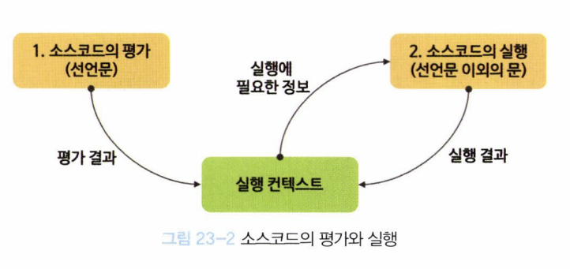

## 실행 컨텍스트

js의 동작원리를 담고 있는 핵심 개념.

## 소스코드의 타입

-   전역 코드: 전역에 존재. 함수, 클래스 등의 내부 코드 포함 안됨.
-   함수 코드: 함수 내부에 존재. 함수에 중첩된 함수는 포함되지 않음.
-   eval 코드: eval 함수에 인수로 전달되어 실행되는 소스 코드
-   모듈 코드: 모듈 내부에 존재. 모듈 내부의 함수, 클래스 등의 내부 코드 포함 안됨.

### 소스코드의 타입에 따라 실행 컨텍스트를 생성하는 과정과 관리 내용이 다르다.

1. 전역 코드
    - 전역 스코프 생성
    - 전역 변수, 전역 함수를 전역 객체의 프로퍼티와 메소드로 바인딩.
2. 함수 코드
    - 지역 스코프 생성
    - 지역 변수, 매개 변수, argumetns 객체 관리.
    - 지역 스코프를 전역 스코프와 체이닝.
3. eval 코드
    - strict 모드에서 자신만의 독자적인 스코프 생성.
4. 모듈 코드
    - 모듈 별로 독립적인 모듈 스코프 생성

## 소스코드의 평가와 실행

-   JS 엔진은 소스코드를 '소스코드의 평가'와 '소스코드의 실행' 2가지 과정으로 나누어 처리

### 평가과정

-   실행 컨텍스트를 생성하고 변수, 함수의 선언문만 먼저 실행. 각 식별자를 실행 컨텍스트의 스코프에 등록.

### 실행과정

-   선언문을 제외한 소스코드가 순차적으로 실행. 즉, 런타임의 시작.
-   변수 값의 변경 등 소스코드의 실행 결과는 다시 실행 컨텍스트에 반영.
<div align="center">

</div>

## 실행 컨텍스트의 역할

-   자바스크립트 엔진은 이 예제를 어떻게 평가하고 실행하는가?

```js
const x = 1;
const y = 2;
function foo(a) {
    const x = 10;
    const y = 20;
    console.log(a + x + y);
}
foo(100);
console.log(x + y);
```

1. 전역 코드 평가
    - 전역 실행 컨텍스트 생성
    - 전역 변수, 전역 함수 등록(only 선언)
        - 이때 전역 변수와 전역 함수는 전역 객체의 프로퍼티와 메소드가 된다.
2. 전역 코드 실행
    - 런타임 시작되어 전역 코드 순차적 실행.
    - 함수 호출 -> 전역 코드 실행 일시 중단 -> 함수 내부 진입
3. 함수 코드 평가
    - 매개변수, 지역 변수 선언문 먼저 실행.
    - 생성된 매개변수와 지역 변수가 실행 컨텍스트가 관리하는 지역 스코프에 등록.
    - argument 객체 생성 및 this 바인딩.
4. 함수 코드 실행
    - 런타임 시작되어 함수 코드 순차적 실행.
    - `console`에 대해 스코프 체인을 통해 검색.
    - 전역 객체에 프로퍼티로 존재하는 `console`을 찾음.
    - log 프로퍼티를 console 객체의 프로토타입 체인을 통해 검색.
    - 이후 console.log 메소드에 인수로 전달된 표현식 `a + x + y`를 평가.
    - 콘솔로그가 출력되면 함수 코드 실행 과정 종료. 전역 코드 실행 재개.

### 즉, 실행 컨텍스트란, 소스코드를 실행하는 데 필요한 환경을 제공하고 코드의 실행결과를 실제로 관리하는 영역이다.

### 식별자와 스코프는 실행 컨텍스트의 렉시컬 환경으로 관리되고, 코드 실행 순서는 실행 컨텍스트 스택으로 관리된다.

### 실행 컨텍스트 스택

-   이건 잘 아니깐 넘어가기

### 렉시컬 환경(Lexical Environment)

-   스코프와, 식별자 나타냄.
-   객체 형태의 스코프 생성하고, 내부에 `식별자`를 `키`로, `식별자에 바인딩된 값`을 `값`으로 등록하고 관리.
-   다음 2개의 컴포넌트로 구성.
    -   환경 레코드(Environment Record)
        -   스코프에 등록된 식별자, 바인딩된 값을 관리하는 저장소.
    -   외부 렉시컬 환경에 대한 참조
        -   상위 스코프에 대한 참조

## 핵심 개념 요약

### 실행 컨텍스트란?

-   **소스코드를 실행하는 데 필요한 환경을 제공하고 코드의 실행결과를 실제로 관리하는 영역**
-   **식별자와 스코프는 렉시컬 환경으로, 코드 실행 순서는 실행 컨텍스트 스택으로 관리**

### 소스코드 처리 과정

1. **평가 과정**: 실행 컨텍스트 생성 → 변수/함수 선언문만 먼저 실행 → 식별자를 스코프에 등록
2. **실행 과정**: 선언문 제외한 소스코드 순차 실행 → 런타임 시작

### 소스코드 타입별 특징

-   **전역 코드**: 전역 스코프 생성, 전역 변수/함수를 전역 객체에 바인딩
-   **함수 코드**: 지역 스코프 생성, 매개변수/지역변수 관리, 스코프 체이닝
-   **eval 코드**: strict 모드에서 독자적 스코프 생성
-   **모듈 코드**: 모듈별 독립적인 스코프 생성

## 면접 예상 질문

### 1. 실행 컨텍스트 기본 개념

**Q: 실행 컨텍스트란 무엇인가요?**

-   소스코드를 실행하는 데 필요한 환경을 제공하고 코드의 실행결과를 실제로 관리하는 영역
-   식별자와 스코프는 렉시컬 환경으로, 코드 실행 순서는 실행 컨텍스트 스택으로 관리

**Q: JavaScript 엔진이 소스코드를 처리하는 과정은?**

-   소스코드 평가: 실행 컨텍스트 생성, 변수/함수 선언문만 먼저 실행
-   소스코드 실행: 선언문 제외한 코드 순차 실행, 런타임 시작

### 2. 호이스팅과 실행 컨텍스트

**Q: 호이스팅이 발생하는 이유는?**

-   소스코드 평가 과정에서 변수/함수 선언문이 먼저 실행되기 때문
-   실행 컨텍스트에 식별자가 등록된 후 실행 과정에서 값이 할당됨

**Q: 다음 코드의 실행 결과는?**

```js
console.log(x); // ?
var x = 1;
function foo() {
    console.log(y); // ?
    var y = 2;
}
foo();
```

### 3. 스코프와 렉시컬 환경

**Q: 렉시컬 환경의 구성 요소는?**

-   환경 레코드: 스코프에 등록된 식별자와 바인딩된 값을 관리
-   외부 렉시컬 환경에 대한 참조: 상위 스코프에 대한 참조

**Q: 스코프 체인이란?**

-   외부 렉시컬 환경에 대한 참조를 통해 상위 스코프와 연결된 구조
-   식별자 검색 시 현재 스코프에서 시작해 상위 스코프로 올라가며 검색

### 4. 실행 컨텍스트 스택

**Q: 실행 컨텍스트 스택의 역할은?**

-   코드 실행 순서를 관리
-   현재 실행 중인 실행 컨텍스트를 추적
-   함수 호출 시 새로운 실행 컨텍스트를 스택에 추가

**Q: 다음 코드의 실행 컨텍스트 스택 변화는?**

```js
function outer() {
    function inner() {
        console.log("inner");
    }
    inner();
}
outer();
```

### 5. 소스코드 타입별 차이점

**Q: 전역 코드와 함수 코드의 실행 컨텍스트 생성 과정의 차이는?**

-   전역 코드: 전역 스코프 생성, 전역 변수/함수를 전역 객체에 바인딩
-   함수 코드: 지역 스코프 생성, 매개변수/지역변수 관리, 스코프 체이닝

**Q: 모듈 코드의 특징은?**

-   모듈별로 독립적인 모듈 스코프 생성
-   전역 스코프와 분리되어 전역 오염 방지
