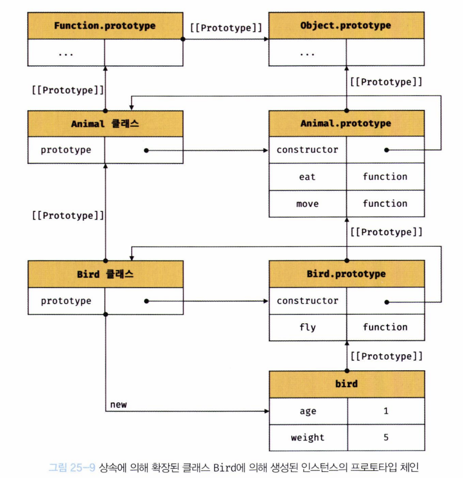

## Class
- ES6에서 도입된 새로운 클래스 문법
- js는 프로토타입 기반 객체지향 언어이지만, 클래스 문법을 제공하여 기존의 프로토타입 기반 객체지향 언어보다 더 간편하게 객체지향 언어의 장점을 활용할 수 있게 해준다.
- 그러나, 클래스와 생성자 함수는 정확히 동일하게 동작하지는 않는다.
- 아래는 그 차이점이다.
1. 클래스는 `new` 연산자 없이 사용하면 에러. 생성자 함수를 `new` 연산자 없이 호출하면 일반 함수로서 호출됨.
2. 클래스는 `extends`, `super`키워드 제공. 생성자 함수는 미지원.
3. 클래스는 호이스팅이 발생하지 않는 것처럼 동작.
4. 클래스 내의 모든 코드는 `strict mode` 적용.
5. 클래스의 `constructor`, `prototype method`, `static method` 모두 [[Enumerable]]은 false. 생성자 함수는 true.

따라서 `클래스`는 새로운 객체 생성 메커니즘으로 보는 것이 타당하다.

## 클래스 정의
- 클래스는 일급 객체이므로, 변수에 할당 가능하며, 함수의 매개변수로 전달 가능하며, 함수의 반환값으로 사용할 수 있다.
- 클래스 몸체에는 constructor, prototype method, static method 정의 가능.

```js
class Person {
    constructor(name) {
        this.name = name;
    }
    sayHello() {
        console.log(`Hi! My name is ${this.name}`);
    }
    static sayHello() { //정적메서드란, 클래스 자신에게 추가한 메소드. 프로토타입에 저장되지 않으며, 인스턴스가 이를 참조할 수 없음.
        console.log("Hello!");
    }
}
```
## 메서드
- 클래스 몸체에서 정의할 수 있는 메서드는 constructor, prototype method, static method 이렇게 3가지이다.
- 그러나 ECMAScript 2022 이후, 프로퍼티도 클래스에서 정의할 수 있다.

### constructor
- 인스턴스를 생성하고 초기화하기 위한 특수한 메서드
- `constructor` 내부에서 `this`에 추가한 프로퍼티는 인스턴스의 프로퍼티가 된다.
- 참고로, 프로토타입의 `constructor`와는 관계가 없다.
  - 프로토타입의 `constructor`은 생성자 함수를 가리킨다.

### prototype method
- 생성자 함수는 명시적으로 추가했어야 했음.
- 클래스 몸체에 정의한 메서드는 기본적으로 프로토타입 메서드가 됨.
- 클래스로 생성된 인스턴스는 프로토타입 메서드를 상속받는다.
```js
class Person {
    constructor(name) {
        this.name = name;
    }
    sayHello() { // 프로토타입 메서드
        console.log(`Hi! My name is ${this.name}`);
    }
}
```

### static method
- 생성자 함수는 명시적으로 추가했어야 했음.
- 클래스 몸체에 정의한 메서드는 기본적으로 정적 메서드가 됨.
- 이는 인스턴스를 생성하지 않고도 호출할 수 있는 메서드이다.
```js
class Person {
    constructor(name) {
        this.name = name;
    }
    sayHello() { // 정적 메서드
        console.log(`Hi! My name is ${this.name}`);
    }
    static sayHello() { // 정적 메서드
        console.log("Hello!");
    }
}
```

## 상속에 의한 클래스 확장
- 프로토타입 기반 상속이랑은 다른 개념.
- 이는 기존 클래스를 상속받아 새로운 클래스를 확장하여 정의하는 것.
- 이는 코드 재사용 관점에서 매우 유용하다.
<div align='center'>

</div>
- 상속을 통해 확장된 클래스를 서브클래스라 부르고, 상속된 클래스를 수퍼클래스라 부른다.
- extends 키워드는 클래스 뿐만 아니라 생성자 함수를 상속받아 클래스를 확장할 수도 있다.

### super 키워드
- 서브클래스에서 수퍼클래스를 참조하기 위해 사용된다.
- 다음은 암묵적으로 적용되는 constructor이다.
```js
class Base {
    constructor(name) {
        this.name = name;
    }
}
class Derived extends Base {
    //다음은 암묵적으로 적용되는 constructor이다.
    // constructor(...args) {
    //     super(...args);
    // }
}
const derived = new Derived("Lee");
console.log(derived.name); // Lee
```

### 서브클래스의 constructor에서 super 호출
- 서브클래스의 constructor에서 반드시 super를 호출해야 한다.
- 물론, constructor을 명시적으로 정의한 경우에만 해당한다.
- 그렇지 않으면 에러가 발생한다.

### 상속 클래스의 인스턴스 생성 과정
```js
class Rectangle {
    constructor(width, height) {
        this.width = width;
        this.height = height;
    }
    getArea() {
        return this.width * this.height;
    }
    toString() {
        return `width = ${this.width}, height = ${this.height}`;
    }
}
class ColorRectangle extends Rectangle {
    constructor(width, height, color) {
        super(width, height);
        this.color = color;
    }
    toString() {
        return super.toString() + `, color = ${this.color}`;
    }
}
const colorRectangle = new ColorRectangle(2, 4, "red");
console.log(colorRectangle.getArea()); // 8
console.log(colorRectangle.toString()); // width = 2, height = 4, color = red
```
- 상속 클래스의 인스턴스 생성 과정은 다음과 같다.
